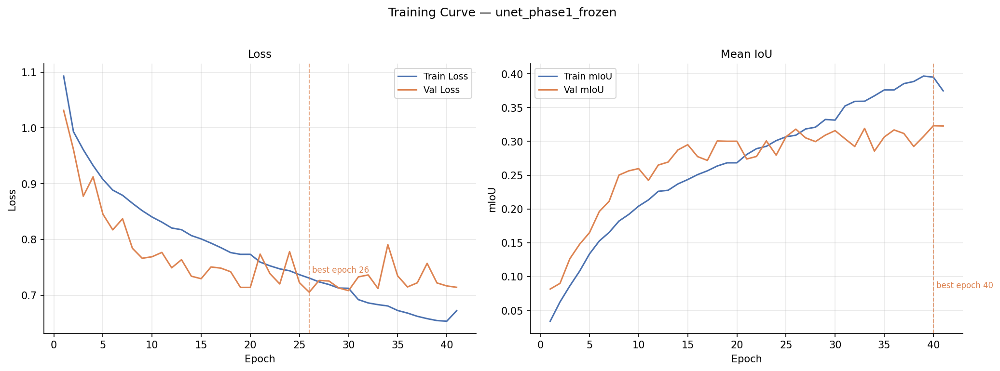
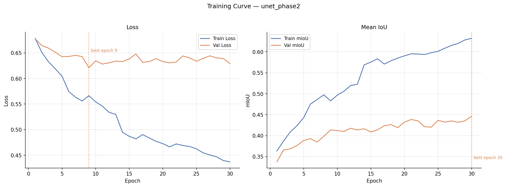
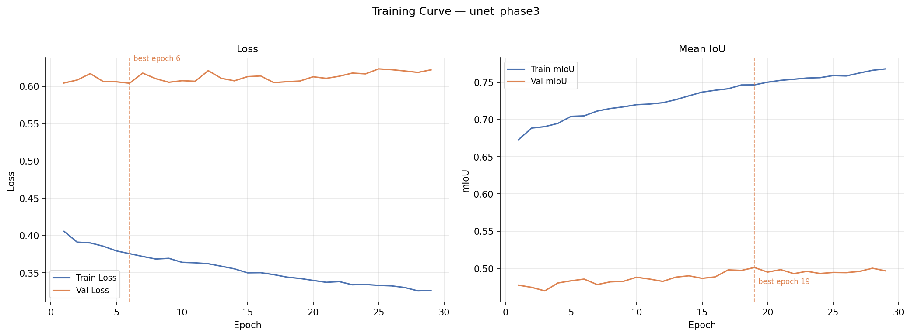
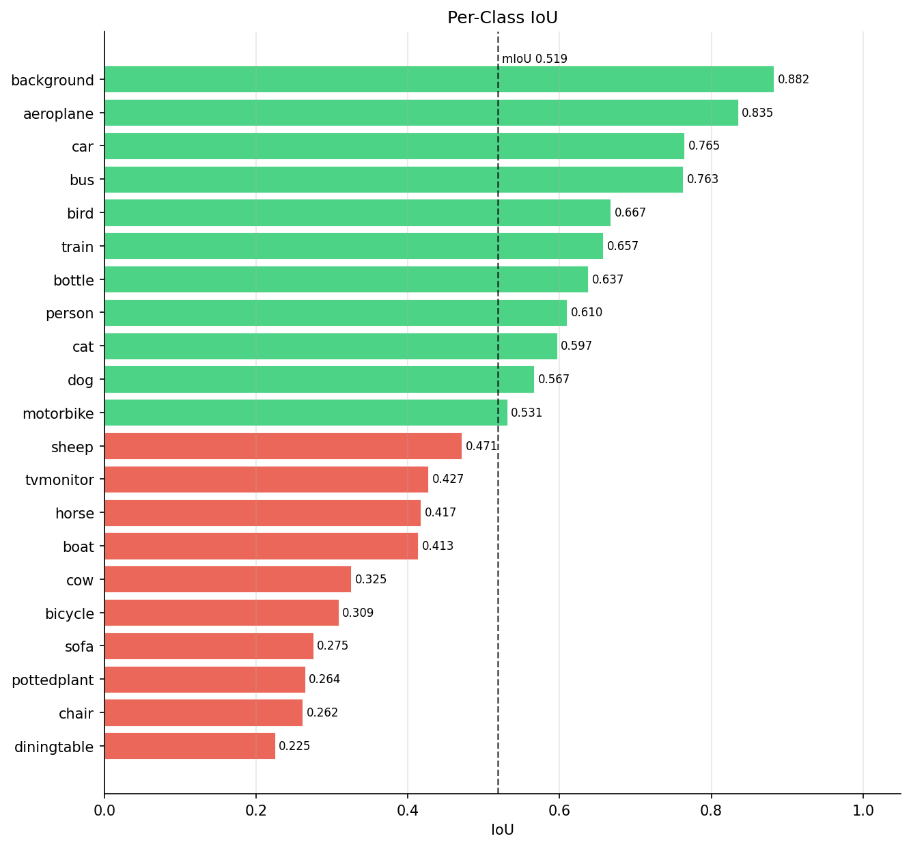
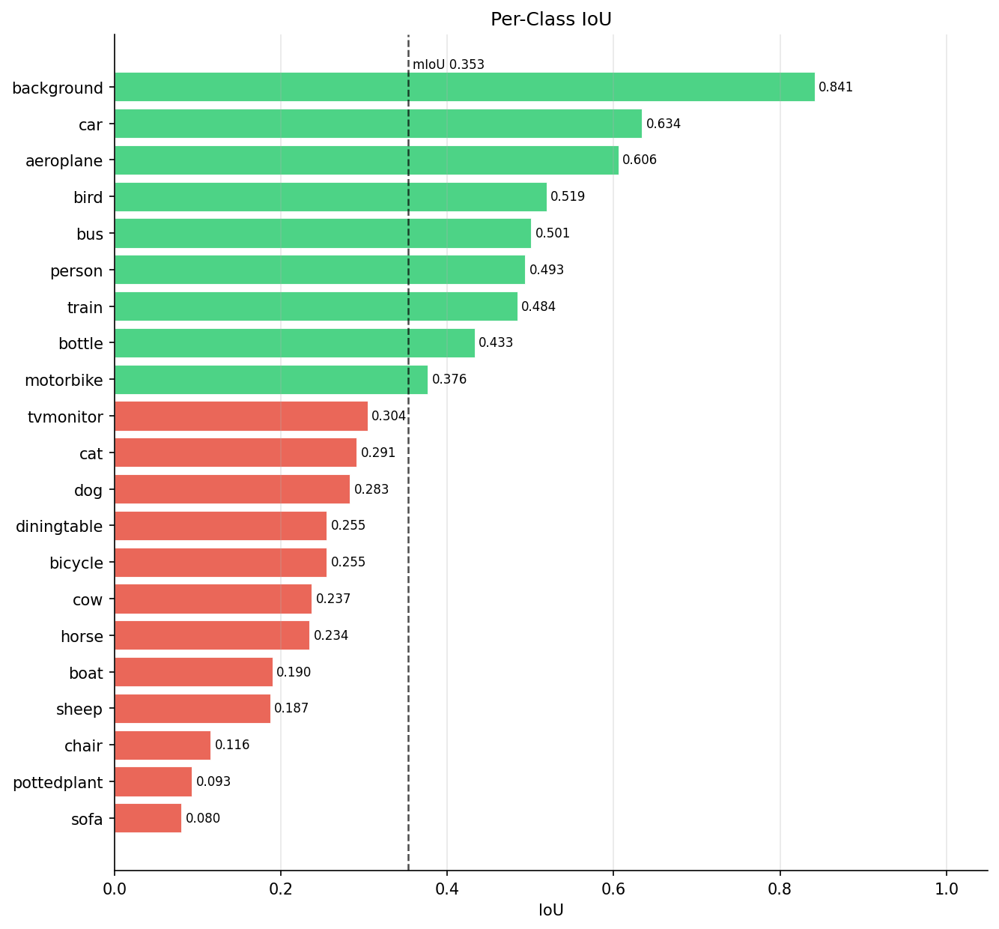
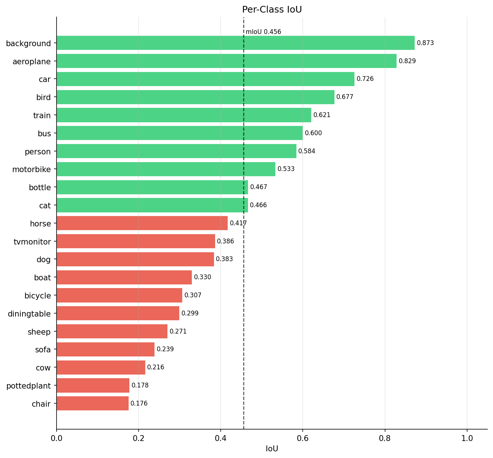

# Pascal VOC Semantic Segmentation — U-Net with EfficientNetB4 Encoder


Semantic segmentation on Pascal VOC 2012 + SBD using a U-Net with a pretrained EfficientNetB4 encoder, trained in three progressive fine-tuning phases and evaluated with a composite metric designed to penalize rare-class blindness.

---

## Table of Contents

- [Project Overview](#project-overview)
- [Repository Structure](#repository-structure)
- [Dataset](#dataset)
- [Model Architecture](#model-architecture)
- [Training Configuration](#training-configuration)
- [Results](#results)
  - [Phase Progression](#phase-progression)
  - [Per-Class IoU — Final Model](#per-class-iou--final-model)
  - [Qualitative Results](#qualitative-results)
  - [Key Takeaways](#key-takeaways)
  - [Limitations](#limitations)
- [Inference](#inference)
- [Reproducibility](#reproducibility)
- [Requirements](#requirements)
- [How to Run](#how-to-run)

---

## Project Overview

Semantic segmentation on Pascal VOC is a well-studied benchmark — but standard mIoU as a sole training signal tends to produce models that are strong on frequent classes and blind to rare ones. This project investigates whether a composite metric that explicitly rewards rare-class IoU alongside global mIoU and Dice can produce a more balanced segmentation model, without sacrificing overall performance.

The model is a U-Net with an ImageNet-pretrained EfficientNetB4 encoder trained in three phases of progressive unfreezing: frozen backbone → partial fine-tuning → deep fine-tuning. Training is managed by a custom `ResumableTrainer` that checkpoints to Google Drive, enabling multi-session training across Colab instances without losing state.

---

## Repository Structure

```
pascal-voc-segmentation/
├── pascal_voc_segmentation.py   # Main training script (all phases + evaluation)
├── helper.py                    # Dataset pipeline, losses, metrics, visualization
├── resumable_trainer.py         # ResumableTrainer — checkpoint/resume logic
└── plots/                       # Training curves, per-class IoU, confusion matrices, qualitative results
```

---

## Dataset

**Pascal VOC 2012 + SBD (Semantic Boundaries Dataset)**

| Split | Source | Size |
|-------|--------|------|
| Train | SBD train + SBD val, deduplicated against VOC val | ~10,582 images |
| Val | 70% of VOC 2012 val (seed 21) | ~1,014 images |
| Test | 30% of VOC 2012 val (seed 21) | ~435 images |

- **21 classes:** background, aeroplane, bicycle, bird, boat, bottle, bus, car, cat, chair, cow, diningtable, dog, horse, motorbike, person, pottedplant, sheep, sofa, train, tvmonitor
- **Void label:** 255 — excluded from loss, all metrics, and evaluation
- **Class imbalance:** Background accounts for ~132× more pixels than the rarest classes. Rare classes tracked explicitly: boat, bottle, cow, pottedplant, sheep, tvmonitor.

Images and masks are sourced from Kaggle (`narendraiitb27/voc-sdb-raw`) and downloaded automatically on first run. All `tf.data` reads happen from local Colab SSD — never directly from Drive — for maximum pipeline throughput.

The pipeline uses `tf.data.Dataset.cache(path)` to cache decoded, resized images to disk. A dedicated `prewarm_cache()` call before training forces this disk-write pass to complete upfront, so epoch 1 runs at full speed rather than paying the I/O cost mid-training. Without it, the first epoch would be several times slower and interfere with timing and early-stopping decisions.

**Augmentation (train split only):**
- Random scale crop (0.75–1.25×)
- Random horizontal flip
- Color jitter: brightness ±0.3, contrast [0.7, 1.3], saturation [0.7, 1.3], hue ±0.1
- Image and mask are augmented in a single concat/split pass to guarantee synchronization

**Preprocessing:** ImageNet mean/std normalization (`[0.485, 0.456, 0.406]` / `[0.229, 0.224, 0.225]`). Input resolution: 384×384.

---

## Model Architecture

**U-Net with EfficientNetB4 encoder** (`unet_efficientnetb4`)

The encoder is EfficientNetB4 pretrained on ImageNet. Skip connections are taken from three intermediate blocks, and the bottleneck feeds a four-stage decoder of bilinear upsampling + conv blocks.

```
Input (384×384×3)
    └─ EfficientNetB4 encoder (ImageNet pretrained)
         ├─ s1: block2d_add  →  (96×96×32)
         ├─ s2: block3d_add  →  (48×48×56)
         ├─ s3: block5f_add  →  (24×24×160)
         └─ b:  top_activation → (12×12×1792)
                    │
              Bottleneck: 2× conv_bn_relu(512)
                    │
         Decoder block 1: UpSample ×2 + concat(s3) + 2× conv_bn_relu(256)
         Decoder block 2: UpSample ×2 + concat(s2) + 2× conv_bn_relu(128)
         Decoder block 3: UpSample ×2 + concat(s1) + 2× conv_bn_relu(64)
         Decoder block 4: UpSample ×4 + 2× conv_bn_relu(32)
                    │
              Conv2D(21, 1) → logits (384×384×21)
```

BatchNormalization layers in the backbone are always kept frozen, even when the surrounding block is unfrozen.

---

## Training Configuration

### Loss

```
CombinedLoss = 0.5 × CrossEntropy + 0.5 × DiceLoss
```

Both terms exclude void pixels (label 255). CrossEntropy uses `SparseCategoricalCrossentropy(from_logits=True, ignore_class=255)`. Dice is computed over softmax probabilities with a 1e-6 smoothing term.

### Composite Metric (model selection)

All three phases monitor `val_composite_score` for checkpointing and early stopping:

```
CompositeScore = 0.40 × mIoU + 0.20 × MeanDice + 0.40 × RareClassIoU
```

Rare classes: boat (4), bottle (5), cow (10), pottedplant (16), sheep (17), tvmonitor (20). Per-class IoU alone is not a sufficient model selection signal — a model can achieve reasonable mIoU while rare classes remain near zero, since background and frequent classes dominate the average. The composite score makes it impossible to select a checkpoint that ignores rare classes: the 40% weight on RareClassIoU ensures any improvement there directly moves the needle on the metric being optimised.

### Phase Schedule

| Phase | Experiment | Backbone | Unfrozen blocks | LR | Max Epochs | Warm-start |
|-------|-----------|----------|------------------|----|------------|------------|
| 1 | `unet_phase1_frozen` | Fully frozen | — | 1e-3 | 40 | ImageNet weights |
| 2 | `unet_phase2` | Partial | block6, block7, top | 1e-4 | 30 | Phase 1 best |
| 3 | `unet_phase3` | Deep | block4–7 + top | 2e-5 | 30 | Phase 2 best |

**Common settings:** Adam optimizer, batch size 16 (train/val), 8 (test), EarlyStopping patience 10 on `val_composite_score`, XLA JIT compilation enabled.

### ResumableTrainer

Training is managed by `ResumableTrainer`, which checkpoints model weights, optimizer state, epoch count, best metric, and patience counter to Google Drive after every epoch. Sessions can be interrupted and resumed from any account that shares the Drive folder — state is fully preserved across disconnects.

---

## Results

### Phase Progression

| Phase | Best Epoch (mIoU) | Val mIoU |
|-------|-------------------|----------|
| Phase 1 — frozen backbone | 40 | 0.320 |
| Phase 2 — partial fine-tuning | 30 | 0.456 |
| Phase 3 — deep fine-tuning | 19 | **0.519** |

Phase 1 establishes a strong decoder with the backbone locked. Phase 2 unlocks the top encoder blocks, producing the largest single jump (+0.136 mIoU). Phase 3 deep fine-tuning adds further refinement, particularly on medium-frequency classes.

**Training curves:**

| Phase 1 | Phase 2 | Phase 3 |
|---------|---------|---------|
|  |  |  |

A consistent pattern across all phases: training loss continues to decrease while validation loss plateaus early. The best composite score checkpoint (used for model selection) often occurs well before the final epoch.

### Per-Class IoU — Final Model

*Phase 3 test set, mIoU = 0.519*



| Class | IoU | Class | IoU |
|-------|-----|-------|-----|
| background | 0.882 | sheep | 0.471 |
| aeroplane | 0.835 | tvmonitor | 0.427 |
| car | 0.765 | horse | 0.417 |
| bus | 0.763 | boat | 0.413 |
| bird | 0.667 | cow | 0.325 |
| train | 0.657 | bicycle | 0.309 |
| bottle | 0.637 | sofa | 0.275 |
| person | 0.610 | pottedplant | 0.264 |
| cat | 0.597 | chair | 0.262 |
| dog | 0.567 | diningtable | 0.225 |
| motorbike | 0.531 | | |

Large rigid objects (aeroplane, car, bus) are segmented reliably. Small or visually ambiguous objects (chair, diningtable, pottedplant) remain the hardest classes. Among the tracked rare classes, bottle (0.637) and sheep (0.471) perform well; cow (0.325) and pottedplant (0.264) remain below the mean.

**Phase-by-phase per-class progression:**

| Phase 1 | Phase 2 | Phase 3 |
|---------|---------|---------|
|  |  |  |

### Qualitative Results


*Left: input image — Centre: ground truth mask — Right: predicted mask*

The model handles single-object scenes well and generalises to cluttered scenes with multiple co-occurring classes (row 8: aeroplane + background; row 18: bicycle). Failure modes are concentrated on small instances and heavily occluded objects.

### Key Takeaways

- Progressive unfreezing is the dominant driver of improvement. The frozen-backbone phase provides a strong initialisation for the decoder, but unlocking the encoder is essential for spatial precision.
- The composite metric successfully prevents rare-class collapse. Bottle IoU improved from 0.433 (Phase 1) to 0.637 (Phase 3), and sheep from 0.187 to 0.471.
- Training loss and validation loss diverge early in all phases, indicating the model has sufficient capacity to overfit. Early stopping on `val_composite_score` rather than on loss prevents selecting an overfitted checkpoint.
- Background dominance (0.882 IoU) inflates mIoU. The 40% weight on RareClassIoU in the composite score partially corrects for this during training, but the class imbalance (~132×) remains the main ceiling on rare-class performance.

### Limitations

- No test-time augmentation or multi-scale inference was used.
- The SBD + VOC split means the test set (VOC val subset) is smaller than typical benchmarks — numbers are not directly comparable to papers reporting on the full VOC test server.
- Chair, diningtable, and sofa remain below 0.28 IoU; these classes frequently appear in cluttered, occluded indoor scenes that are hard to separate at 384×384 resolution.

---

## Inference

```python
import tensorflow as tf
from helper import get_best_model_path, get_predictions, plot_qualitative_results
from resumable_trainer import find_checkpoint_root

CKPT_ROOT = find_checkpoint_root("Colab_Experiments")
PROJECT   = "pascal_voc_segmentation"

# Load best Phase 3 model
model = tf.keras.models.load_model(
    str(get_best_model_path(CKPT_ROOT, PROJECT, "unet_phase3"))
)

# Run on test set
y_true, y_pred = get_predictions(model, test_ds)

# Visualise predictions
plot_qualitative_results(model, test_ds, n_rows=10)
```

---

## Reproducibility

Global seed `21` is set at the start of the notebook:

```python
import os, random
import numpy as np
import tensorflow as tf

SEED = 21
random.seed(SEED)
np.random.seed(SEED)
tf.random.set_seed(SEED)
tf.keras.utils.set_random_seed(SEED)
os.environ["PYTHONHASHSEED"] = str(SEED)
```

> **Note:** Results may vary slightly across runs due to GPU non-determinism (non-deterministic CUDA ops in cuDNN). The numbers reported here were obtained on Google Colab with a **T4** GPU.

---

## Requirements

```
tensorflow >= 2.x
numpy
pandas
matplotlib
pillow
scipy
tqdm
kaggle
```

Install with:

```bash
pip install scipy tqdm kaggle
```

`helper.py` and `resumable_trainer.py` are downloaded automatically at the start of the notebook from GitHub — no manual setup needed.

**Hardware:** A GPU is required. All experiments were run on a Google Colab T4 GPU.

**Data:** The dataset is downloaded automatically from Kaggle on first run and cached to Google Drive. Subsequent sessions skip the download entirely.

---

## How to Run

1. Open the notebook in Google Colab, mount Drive, and run Section 0. `helper.py` and `resumable_trainer.py` are downloaded automatically from GitHub.

2. Place `kaggle.json` in the root of your `Colab_Experiments` Drive folder (one-time setup). The pipeline authenticates and downloads the dataset automatically on first run.

3. Run all cells in order. Approximate runtimes on a T4 GPU:

   | Section | Description | Runtime |
   |---------|-------------|---------|
   | 0–4 | Setup, data, EDA | ~25 min (first run) / ~5 min (subsequent) |
   | 6.1 | Phase 1 — frozen backbone | ~3–4 hrs |
   | 6.2 | Phase 2 — partial fine-tuning | ~2–3 hrs |
   | 6.3 | Phase 3 — deep fine-tuning | ~2–3 hrs |
   | 6.4 | Evaluation & plots | ~10 min |

   > Total: approximately 8–10 hours across multiple sessions.

4. If a session disconnects, re-run the relevant phase cell — `ResumableTrainer` restores weights, optimizer state, epoch counter, and patience from the latest checkpoint automatically.

> For local execution, skip the Drive mount and set `CKPT_ROOT` to a local path.


